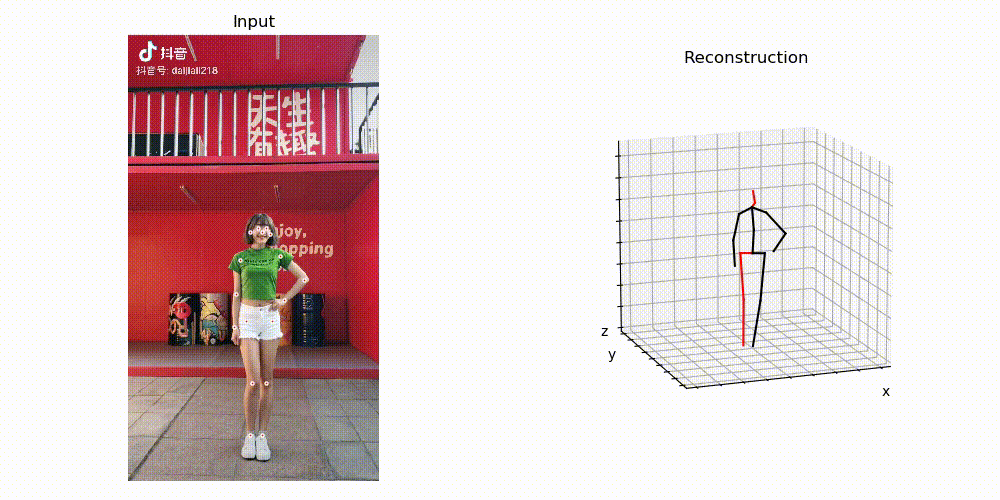
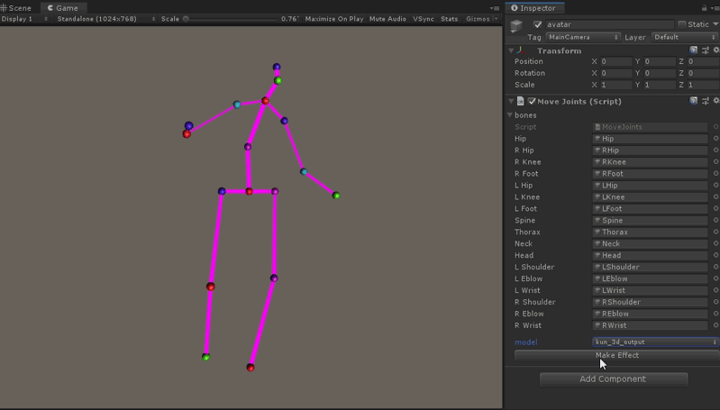
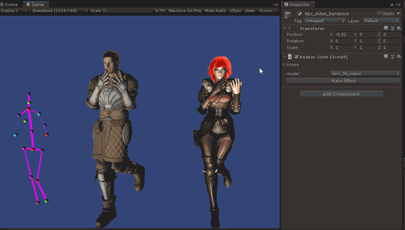

# 从抖音视频提取3D动作

### python 建立AI模型

  

### unity中关联模型

  

### avatar应用模型

  

## 文档

* [unityEnv](./unity/README.md)
* [pythonEnv](./python/README.md)
* [Blog](https://penghuailiang.gitee.io/blog/2020/3dpose)