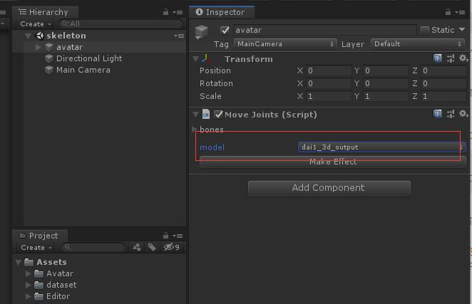
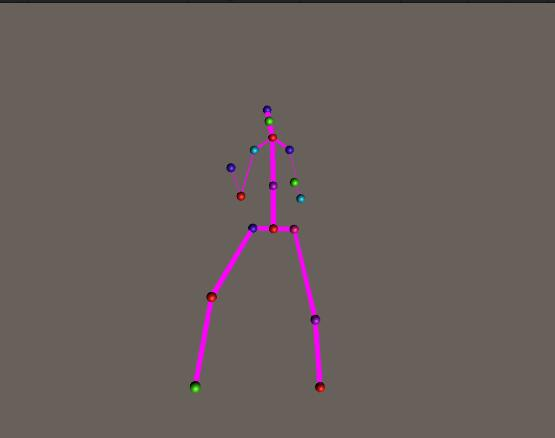
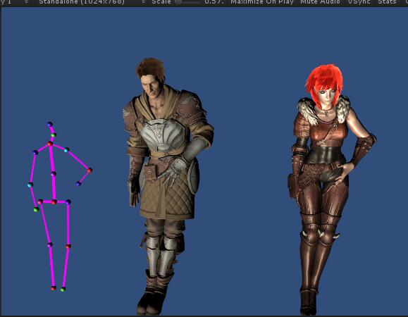

# Unity Animation 

1. 首先 需要从python导出模型训练文件 ， 然后在本地Assets目录下 创建database文件夹，把导出的模型动作放在database目录

你也可以下载导出好的模型：

链接:https://pan.baidu.com/s/1FDz0nBsJ1sx15MDuSOrt4A  密码:a3iy

2. unity工程中有两个展示scene

* skeleton
* avatar

在skeleton场景中 我们直接使用导出的位置坐标生成一个人形动画：

  

你可以在Inspector窗口切换模型动作：

  

在avatar场景中我们引入骨骼蒙皮的角色来展示动作：

  